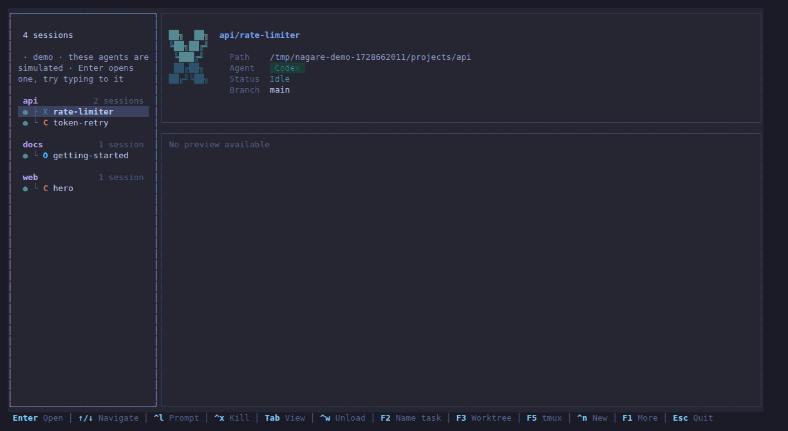

<h1 align="center">nagare 流れ</h1>
<p align="center"><b>Every coding agent, one screen.</b><br>
Run Claude Code, Codex, OpenCode, Gemini CLI, Crush, pi and OhMyPi side by side, see which one needs you, answer it, review what it changed — without ever leaving the terminal UI.</p>

<p align="center">
  
</p>

<p align="center"><i>Try it in ten seconds, no agents or API keys needed:</i> <code>nagare-go demo</code></p>

## Why nagare

- **Work inside it.** Press Enter on any agent and its live terminal opens right there, next to a sidebar of everything else that is running. Type to it, answer its permission prompts, interrupt it with Esc.
- **Watch several at once.** `Alt+v` splits the screen into up to four live agents. The one with the keyboard wears a gradient frame; the rest keep streaming and shout **needs you** the moment they block.
- **Know who is waiting.** Agents report their state through hooks and plugins, not screen scraping, so nagare knows exactly who is working, idle or waiting for you. `F4` walks the queue of waiting agents.
- **Review before you trust.** `Alt+d` shows what an agent changed: every touched file with line counts, and git's own diff. Enter opens the file in your editor.
- **A shell one chord away.** `Alt+s` opens a shell in the agent's directory, for the `git status` and test runs that every session ends with.
- **Worktrees built in.** `F3` starts a new agent in a fresh git worktree of the same repo, grouped under it, with the worktree kept out of your main checkout's `git status`.
- **Agents that talk to each other.** A built-in MCP server lets your agents discover, message and wait on one another.
- **Built on tmux, not instead of it.** Your agents run in ordinary tmux sessions: they survive nagare closing, you can attach to them from anywhere, and the sessions you already have show up immediately. nagare itself does not need to run inside tmux.
- **Fast and small.** One Go binary, 3ms startup, a 30fps live terminal that costs under a millisecond a frame. 13 themes.

## Quick start

```bash
git clone https://github.com/nemanja-micovic/nagare-go
cd nagare-go
./compile.bash          # or: go build -o nagare-go .

./nagare-go demo        # try it with simulated agents — nothing touches your real setup
./nagare-go setup       # connect your real agents (hooks, MCP, slash commands)
./nagare-go             # open nagare
```

Requires tmux 3.2+ and git. Prebuilt binaries: see [Releases](https://github.com/nemanja-micovic/nagare-go/releases), or

```bash
curl -fsSL https://raw.githubusercontent.com/nemanja-micovic/nagare-go/main/install.sh | sh
```

### The demo

`nagare-go demo` starts a private tmux server with simulated Claude Code, Codex and
OpenCode agents working in throwaway git repositories. They behave like the real
thing: they report status, make real edits you can review, stop at permission
prompts that wait for your answer, and reply to whatever you type. Everything is
deleted when you quit. `--speed 2` runs them twice as fast.

## Working inside nagare

| Key | In the list | In focus mode |
|-----|-------------|---------------|
| Enter | open the agent inside nagare | *(goes to the agent)* |
| Ctrl+k / Alt+k | command palette | command palette |
| F4 | jump to the next agent waiting on you | same |
| Alt+v | | split: add the next agent as a live tile |
| Alt+← / Alt+→ | | move between tiles |
| Alt+x | | close the tile |
| Alt+↑ / Alt+↓ | | previous / next agent in this tile |
| Ctrl+d / Alt+d | review the agent's changes | same |
| Alt+s | | shell in the agent's directory (again: back) |
| Shift+PgUp / PgDn | | scroll back through history (the wheel works too) |
| Alt+z | | zoom: hide the sidebar |
| Ctrl+] | | back to the list (`picker.focus_leave_key`) |
| F5 | open the agent in tmux | same; outside tmux, detaching returns to nagare |
| F1 | every key | every key |

In focus mode everything not in this table goes straight to the agent — including
Esc, which is how you interrupt Claude Code.

<details>
<summary>All list keys</summary>

| Key | Action |
|-----|--------|
| Type | Fuzzy search |
| Tab | Toggle list / grid view |
| Ctrl+y / Ctrl+a | Approve a permission / approve always |
| Ctrl+l / Ctrl+g | Send a prompt inline / from $EDITOR |
| Ctrl+n / Ctrl+r | New session / quick prototype |
| F2 / F3 | Name the task / new git worktree |
| Ctrl+f / Ctrl+o / Ctrl+s | Star / cycle sort / show saved sessions |
| Ctrl+w / Ctrl+x | Unload the agent / kill its window |
| Ctrl+t / Ctrl+e | Theme picker / edit config |
| Esc | Quit |

</details>

## Setup

`nagare-go setup` connects every agent you have installed:

1. **Status reporting**, so each agent tells nagare what it is doing:

   | Agent | Mechanism |
   |-------|-----------|
   | Claude Code | hooks in `~/.claude/settings.json` |
   | Codex | hooks in `~/.codex/hooks.json` |
   | Gemini CLI | hooks in `~/.gemini/settings.json` |
   | OpenCode | plugin at `~/.config/opencode/plugins/nagare.js` |
   | pi | extension at `~/.pi/agent/extensions/nagare.ts` |
   | OhMyPi (`omp`) | extension at `~/.omp/agent/extensions/nagare.ts` |

2. **The MCP server** for inter-agent messaging, registered with Claude Code, Codex, Gemini CLI, OpenCode, Crush and OhMyPi. pi has no MCP client by design, so its extension routes the same tools through `nagare-go tool`.

3. **Messaging workflows** as slash commands (`/nagare-ls`, `/nagare-send`, `/nagare-send-wait`, `/nagare-inbox`), and as Agent Skills for Codex and Crush.

Re-running `setup` is safe. Codex asks you to review newly installed hooks once: open `/hooks` in Codex and trust them.

Optionally, open nagare from tmux with a key:

```bash
# ~/.tmux.conf — prefix + g
bind g display-popup -w100% -h100% -B -E "/path/to/nagare-go"
```

## Commands

```bash
nagare-go              # open nagare (default)
nagare-go demo         # try it with simulated agents
nagare-go new ~/proj   # new session with Claude (-a codex|opencode|gemini|crush|pi|omp)
nagare-go new ~/proj -w my-feature   # new agent in a fresh git worktree
nagare-go new myproto  # quick prototype in ~/Prototypes/
nagare-go notifs       # notification center + settings
nagare-go setup        # connect agents: status, MCP, slash commands
nagare-go mcp          # MCP server (stdio, used by agent CLIs)
```

## Configuration

`~/.config/nagare/config.toml` (Ctrl+e opens it):

```toml
[picker]
enter_action = "focus"       # "jump" switches to the session in tmux instead
focus_leave_key = "ctrl+]"   # e.g. "ctrl+q" where Ctrl+] is awkward to type
mouse = true
animations = true
show_help_bar = true

[appearance]
theme = "tokyonight"         # aura, catppuccin, dracula, flexoki, gruvbox, kanagawa,
                             # monokai, nord, onedark, onedarkpro, rosepine, vesper

[notifications.needs_input]
toast = true
bell = true
os_notify = true

[notifications.task_complete]
toast = true
min_working_seconds = 30
```

## How it works

tmux runs the agents; nagare is the screen you work on them from. For each agent on
screen, nagare fits its tmux window to the tile it is drawn in, captures the rendered
pane (at 30fps while it changes, backing off when it does not), and forwards your
keystrokes back with `send-keys` — so every agent works unmodified, and closing
nagare leaves every window exactly as it found it. Agent state comes from hooks and
plugins that each agent calls on every event. See [CLAUDE.md](CLAUDE.md) for the
design notes.

Built with [Bubble Tea](https://github.com/charmbracelet/bubbletea), [Lip Gloss](https://github.com/charmbracelet/lipgloss) and [Cobra](https://github.com/spf13/cobra). A Go rewrite of [nagare](https://github.com/nmicovic/nagare), compatible with its state files and hooks.

## License

MIT
